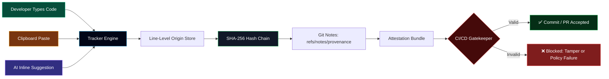

I checked your repo and tailored this for **Code Provenance Tracker**: it’s a VS Code/React project with provenance tracking, Git Notes, SHA-256 hash-chain verification, reporting, attestation export, CI/CD gatekeeper commands, and version `0.0.1`.   
For GitHub README animation, the safest “best” approach is animated SVG/banner images because GitHub Markdown supports Markdown/limited HTML but filters unsafe script-style content. 

Copy-paste this into your **`README.md`**:

```md
<!--
  ✨ Animated README for:
  https://github.com/vedantyerne1-art/code-provience
-->

<p align="center">
  
</p>

<p align="center">
  <a href="https://github.com/vedantyerne1-art/code-provience">
    
  </a>
</p>

<p align="center">
  
  
  
  
  
</p>

<p align="center">
  
  
  
  
</p>

---

## 🛡️ Cryptographic Authenticity Seal

<p align="center">
  
</p>

| Metric | Value |
| :--- | :--- |
| **Authorship Ratio** | **100% Human** / **0% AI** |
| **Terminal Root Hash** | `0000000000000000000000000000000000000000000000000000000000000000` |
| **Hash Chain Events** | ✅ Verified Intact |
| **Git Notes Ref** | `refs/notes/provenance` |
| **Timestamp Sealed** | `2026-09-04T17:35:33.544Z` |

> **Code Provenance Tracker** creates a privacy-preserving audit trail for software authorship.  
> It tracks whether code was **typed**, **pasted**, or **AI-assisted**, then secures that metadata into a tamper-evident SHA-256 hash chain and anchors it with Git Notes.

---

## 🚀 What Makes It Powerful?

<table>
<tr>
<td width="50%">

### 🔍 Authorship Detection
Tracks how code entered your workspace:

- ⌨️ Hand typed
- 📋 Pasted
- 🤖 AI-generated / inline suggestion
- 🧬 Modified after insertion

</td>
<td width="50%">

### 🔐 Cryptographic Trust
Every event becomes part of a verifiable chain:

- SHA-256 hash links
- Genesis root
- Tamper detection
- Git Notes anchoring

</td>
</tr>
<tr>
<td width="50%">

### 📊 Function-Level Labels
Shows provenance near code:

- Human vs AI ratio
- CodeLens indicators
- Heatmap overlays
- File-level statistics

</td>
<td width="50%">

### 🚦 CI/CD Gatekeeper
Protects pull requests:

- Blocks unsafe AI thresholds
- Verifies provenance bundle
- Detects broken chains
- Enforces policy rules

</td>
</tr>
</table>

---

## 🧠 Animated System Flow



---

## ✨ Core Features

| Feature | Description |
| :--- | :--- |
| 🧠 **Deterministic AI Interception** | Tracks native VS Code inline suggestions from AI tools like Copilot, Cursor, and Tabnine. |
| 🧾 **Function-Level Nutrition Labels** | Shows authorship distribution directly above functions using CodeLens-style indicators. |
| 🔗 **Tamper-Evident Hash Chain** | Creates a SHA-256 chain of edit events so manipulation breaks verification. |
| 📝 **Git Notes Anchoring** | Stores provenance metadata outside source code under `refs/notes/provenance`. |
| 🚦 **CI/CD Gatekeeper** | Generates automated policy checks for AI percentage, typed percentage, and chain validity. |
| 🕶️ **Zero-Knowledge Privacy** | Stores aggregates, timestamps, hashes, and line counts — not private source content. |
| 📊 **Reports & Attestations** | Exports Markdown/HTML reports and provenance attestation bundles. |
| 🎨 **Heatmap Decorations** | Visualizes code origin directly inside VS Code. |

---

## 🧰 Tech Stack

<p align="center">
  
</p>

| Layer | Tools |
| :--- | :--- |
| **Extension Runtime** | VS Code Extension API |
| **Frontend Playground** | React + Vite |
| **Language** | TypeScript + JavaScript |
| **Security Core** | SHA-256 Hash Chain |
| **Version Control Anchor** | Git Notes |
| **Testing** | Node Test Runner |
| **Styling / UI** | Tailwind-style utility UI + Lucide Icons |

---

## 📦 Quick Start

```bash
# 1. Clone the repository
git clone https://github.com/vedantyerne1-art/code-provience.git

# 2. Enter the project
cd code-provience

# 3. Install dependencies
npm install

# 4. Start the Vite playground
npm run dev
```

Then open:

```txt
http://localhost:3000
```

---

## 🧪 Useful Commands

```bash
# Build production bundle
npm run build

# Preview production build
npm run preview

# Run tests
npm test

# Type-check / lint
npm run lint

# Clean generated build files
npm run clean
```

---

## 🧭 VS Code Commands

Open the VS Code Command Palette:

```txt
Ctrl + Shift + P
```

Then run any of these commands:

| Command | Purpose |
| :--- | :--- |
| `Provenance: Hello World` | Confirms the extension is active. |
| `Provenance: Toggle Heatmap` | Shows/hides authorship heatmap decorations. |
| `Provenance: Save Git Note` | Saves provenance metadata to Git Notes. |
| `Provenance: Show Git Note` | Opens the current provenance note. |
| `Provenance: Verify Hash Chain` | Verifies all cryptographic links. |
| `Provenance: Generate Provenance Report` | Generates a readable provenance report. |
| `Provenance: Export Attestation Bundle` | Exports a verifiable attestation bundle. |
| `Provenance: Install Git Pre-Commit Hook` | Adds local pre-commit provenance verification. |
| `Provenance: Run and Analyze Code` | Runs and analyzes code provenance. |
| `Provenance: Generate CI/CD Gatekeeper` | Generates automated CI policy enforcement. |
| `Provenance: Generate Final Repository Seal` | Produces the final authenticity seal. |

---

## 🌐 Supported Languages

<p align="center">
  
  
  
  
  
  
  
  
  
</p>

---

## 🔐 How The Hash Chain Works

```txt
Genesis Hash
    │
    ▼
Edit Event #1 ── SHA-256(prevHash + eventData) ──► hash_1
    │
    ▼
Edit Event #2 ── SHA-256(hash_1 + eventData) ────► hash_2
    │
    ▼
Edit Event #3 ── SHA-256(hash_2 + eventData) ────► hash_3
```

If any previous event changes, every following hash breaks.

```txt
✅ Valid Chain:
hash_0 → hash_1 → hash_2 → hash_3

❌ Tampered Chain:
hash_0 → hash_1 → modified_event → BROKEN
```

---

## 📊 Provenance Report Example

```md
# Code Provenance Report

Generated: 2026-09-04T17:35:33.544Z

## Workspace Summary

- Total Tracked Lines: 128
- Hand-Typed: 92%
- Pasted: 8%
- AI-Generated: 0%

## Cryptographic Audit

- Status: Verified
- Chain: Intact
- Git Notes Ref: refs/notes/provenance
```

---

## 🚦 CI/CD Gatekeeper Policy

Example policy:

```json
{
  "maxAiPercentage": 50,
  "minTypedPercentage": 20,
  "maxPastedPercentage": 50,
  "requireChain": true
}
```

The gatekeeper can reject commits or pull requests when:

- AI-generated percentage exceeds policy
- Typed percentage is too low
- Hash chain is invalid
- Provenance bundle is missing or corrupted
- Language restriction rules are violated

---

## 🗂️ Project Structure

```txt
code-provience/
├── src/
│   ├── components/
│   ├── App.tsx
│   ├── browserRunner.ts
│   ├── capstone.js
│   ├── codeLens.js
│   ├── decorations.js
│   ├── gitNotes.js
│   ├── hashChain.js
│   ├── languageValidator.ts
│   ├── languages.ts
│   ├── lineStore.js
│   ├── main.tsx
│   ├── pipelineGen.js
│   ├── provenanceEngine.ts
│   ├── report.js
│   ├── runner.js
│   ├── tracker.js
│   ├── types.ts
│   └── verifier.js
├── test/
├── extension.js
├── index.html
├── metadata.json
├── package.json
├── tsconfig.json
├── vite.config.ts
└── README.md
```

---

## 🧬 Privacy Model

<p align="center">
  
</p>

Code Provenance Tracker records metadata such as:

```txt
✅ line counts
✅ origin categories
✅ timestamps
✅ hash values
✅ aggregate percentages
```

It avoids storing:

```txt
❌ private source code
❌ clipboard contents
❌ prompt text
❌ secrets
```

---

## 🧪 Verification Example

```bash
# Verify the provenance hash chain
Provenance: Verify Hash Chain

# Save provenance metadata to Git Notes
Provenance: Save Git Note

# Show the Git note attached to HEAD
Provenance: Show Git Note
```

---

## 🏁 Roadmap

- [x] Typed / pasted / AI-origin tracking
- [x] SHA-256 tamper-evident hash chain
- [x] Git Notes anchoring
- [x] Heatmap visualization
- [x] Provenance report generation
- [x] Attestation bundle export
- [x] CI/CD policy gatekeeper generation
- [ ] Marketplace publishing package
- [ ] Signed release artifacts
- [ ] Dashboard screenshots / GIF demo
- [ ] Policy templates for teams and classrooms

---

## 🤝 Contributing

Pull requests are welcome.

```bash
# Create a feature branch
git checkout -b feature/amazing-provenance-feature

# Commit your work
git commit -m "Add amazing provenance feature"

# Push to GitHub
git push origin feature/amazing-provenance-feature
```

Then open a pull request.

---

## ⚠️ Note

Before publishing this project publicly or to the VS Code Marketplace, consider adding:

- `LICENSE`
- `.vscodeignore`
- Marketplace icon
- Screenshots or demo GIF
- CI workflow file
- Security policy

---

<p align="center">
  
</p>
```

After pasting it, commit it:

```bash
git add README.md
git commit -m "Add animated project README"
git push
```
