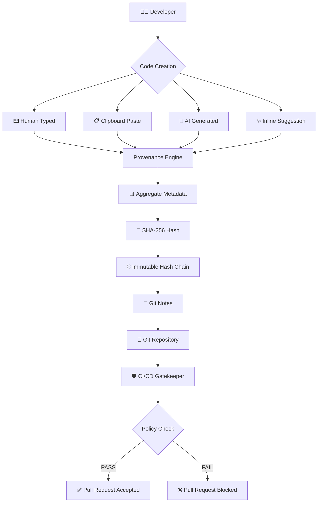

<div align="center">

# 🛡️ CODE PROVENANCE TRACKER

### `Know who wrote the code. Know how it was created. Prove it. 🔐`

<p>
  
  
  
  
</p>

<br>


<br>

### ⚡ `Every commit tells a story.`

### 🔐 `Every provenance event leaves a fingerprint.`

</div>

---

# 🧬 What Is This?

**Code Provenance Tracker** is a cryptographic developer-tooling system designed to determine **how code entered a repository** and preserve that information as a tamper-evident provenance trail.

Instead of simply asking:

> **"Who committed this code?"**

it asks the deeper question:

> **"How was this code actually created?"**

The system tracks provenance signals such as:

```text
⌨️  HAND TYPED
      ↓
📋  PASTED
      ↓
🤖  AI GENERATED
      ↓
✨  INLINE AI SUGGESTION
      ↓
🔐  CRYPTOGRAPHICALLY SEALED
      ↓
📦  ATTACHED TO GIT COMMIT
```

The result is a **machine-verifiable provenance layer** for modern AI-assisted software development.

---

# 🖥️ SYSTEM INITIALIZATION

```text
┌───────────────────────────────────────────────────────────────┐
│                  CODE PROVENANCE TRACKER                     │
├───────────────────────────────────────────────────────────────┤
│                                                               │
│   [01] Developer Activity        ████████████████  ONLINE     │
│   [02] AI Detection              ████████████████  ONLINE     │
│   [03] Provenance Engine         ████████████████  ONLINE     │
│   [04] SHA-256 Hash Chain        ████████████████  SECURE     │
│   [05] Git Notes Anchor          ████████████████  VERIFIED   │
│   [06] CI/CD Gatekeeper          ████████████████  ACTIVE     │
│                                                               │
│                 SYSTEM STATUS: ● OPERATIONAL                 │
│                                                               │
└───────────────────────────────────────────────────────────────┘
```

---

# 🚀 Why Does This Matter?

AI coding assistants have changed software development.

Today, a developer may write code using:

```text
Human typing
     +
Copy / Paste
     +
GitHub Copilot
     +
Cursor
     +
Tabnine
     +
Native inline suggestions
```

Traditional Git history doesn't capture this distinction.

Two commits may look identical:

```text
Developer A → wrote everything manually

Developer B → generated everything with AI
```

Git knows **who committed it**.

It doesn't necessarily know **how it was produced**.

That's the problem this project attacks.

---

# 🧠 CORE CONCEPT



---

# ⚡ FEATURE MATRIX

<table>
<tr>
<td width="50%">

### 🤖 AI INTERCEPTION

Detect provenance signals from modern AI coding workflows.

```text
✓ GitHub Copilot
✓ Cursor
✓ Tabnine
✓ Inline suggestions
```

</td>

<td width="50%">

### 🔐 CRYPTOGRAPHIC CHAIN

Every provenance event contributes to a deterministic SHA-256 chain.

```text
EVENT
  ↓
HASH
  ↓
NEXT HASH
  ↓
IMMUTABLE HISTORY
```

</td>
</tr>

<tr>
<td>

### 🏷️ FUNCTION-LEVEL LABELS

CodeLens-style indicators expose provenance directly above functions.

```text
function calculateRisk()

Human      ████████░░ 80%
AI         ██░░░░░░░░ 20%
```

</td>

<td>

### 📝 GIT NOTES

Provenance metadata lives independently from source code.

```text
refs/notes/provenance
        │
        ▼
   Git Commit
```

</td>
</tr>

<tr>
<td>

### 🚦 CI/CD GATEKEEPER

Repositories can enforce provenance policies automatically.

```text
AI Threshold
     │
     ▼
  Evaluate
   /    \
 PASS   FAIL
  │      │
  ✓      ✕
```

</td>

<td>

### 🕵️ ZERO-KNOWLEDGE PRIVACY

The system records metadata rather than source code.

```text
✓ Aggregates
✓ Timestamps
✓ Line counts
✓ Provenance events

✗ Source code
✗ Clipboard contents
```

</td>
</tr>
</table>

---

# 🔥 PROVENANCE PIPELINE

```text
                 ┌──────────────────┐
                 │   DEVELOPER      │
                 └────────┬─────────┘
                          │
                          ▼
               ┌─────────────────────┐
               │  CODE CREATION      │
               └─────────┬───────────┘
                         │
            ┌────────────┼────────────┐
            ▼            ▼            ▼
        HUMAN         PASTE          AI
         CODE           │             │
            └───────────┼─────────────┘
                        ▼
               ┌─────────────────┐
               │ PROVENANCE      │
               │ ENGINE          │
               └────────┬────────┘
                        │
                        ▼
               ┌─────────────────┐
               │ EVENT METADATA   │
               └────────┬────────┘
                        │
                        ▼
               ┌─────────────────┐
               │ SHA-256 HASH     │
               └────────┬────────┘
                        │
                        ▼
               ┌─────────────────┐
               │ HASH CHAIN       │
               └────────┬────────┘
                        │
                        ▼
               ┌─────────────────┐
               │ GIT NOTES        │
               └────────┬────────┘
                        │
                        ▼
               ┌─────────────────┐
               │ CI/CD POLICY     │
               └─────────────────┘
```

---

# 🔐 CRYPTOGRAPHIC MODEL

The provenance chain is designed around deterministic hashing.

```text
Genesis
   │
   ▼
H₀
   │
   ├── Event₁ ──► H₁
   │
   ├── Event₂ ──► H₂
   │
   ├── Event₃ ──► H₃
   │
   └── Event₄ ──► H₄
                    │
                    ▼
               TERMINAL HASH
```

Conceptually:

```text
Hₙ = SHA256(
      Hₙ₋₁
      +
      Eventₙ
      +
      Timestampₙ
      +
      Metadataₙ
     )
```

Changing an earlier provenance event changes the resulting chain.

That makes retroactive manipulation **detectable**.

---

# 🧪 PROVENANCE EXAMPLE

Imagine a developer creates a function:

```ts
function calculateScore(data: number[]) {
    return data.reduce((a, b) => a + b, 0);
}
```

The provenance layer can represent the contribution as:

```text
┌────────────────────────────────────┐
│ calculateScore()                   │
├────────────────────────────────────┤
│                                    │
│ Human        ████████████  75%     │
│ AI           ████░░░░░░░  25%      │
│                                    │
│ Events: 4                          │
│ Lines:  3                          │
│ Status: VERIFIED                   │
│                                    │
└────────────────────────────────────┘
```

The source itself does **not** need to be stored in the provenance metadata.

---

# 🛡️ TAMPER DETECTION

```text
                 ORIGINAL HISTORY

Commit A ──► Event 1 ──► Event 2 ──► Event 3
               │           │           │
               ▼           ▼           ▼
              H₁          H₂          H₃


                 AFTER MANIPULATION

Commit A ──► Event 1 ──► ❌ Event 2 ──► Event 3
                           │
                           ▼
                        HASH MISMATCH
                           │
                           ▼
                    🚨 CHAIN INVALID
```

### The goal:

```text
VALID CHAIN
     ↓
🟢 VERIFIED

MODIFIED CHAIN
     ↓
🔴 TAMPER DETECTED
```

---

# 📊 CURRENT PROVENANCE SEAL

<div align="center">

```text
╔══════════════════════════════════════════════════════════╗
║                 🔐 PROVENANCE SEAL                      ║
╠══════════════════════════════════════════════════════════╣
║                                                          ║
║  AUTHORSHIP       │  100% HUMAN / 0% AI                ║
║                                                          ║
║  ROOT HASH        │  SHA-256                            ║
║                                                          ║
║  HASH CHAIN       │  ✓ VERIFIED                         ║
║                                                          ║
║  GIT NOTES        │  refs/notes/provenance              ║
║                                                          ║
║  PRIVACY          │  ZERO-KNOWLEDGE METADATA            ║
║                                                          ║
║  STATUS           │  ● CRYPTOGRAPHICALLY ANCHORED      ║
║                                                          ║
╚══════════════════════════════════════════════════════════╝
```

</div>

---

# 🧩 ARCHITECTURE

```text
                         ┌──────────────────────┐
                         │      VS CODE         │
                         │                      │
                         │  Developer Activity  │
                         └──────────┬───────────┘
                                    │
                                    ▼
                         ┌──────────────────────┐
                         │  EXTENSION LAYER     │
                         └──────────┬───────────┘
                                    │
                                    ▼
                         ┌──────────────────────┐
                         │ PROVENANCE ENGINE    │
                         └──────────┬───────────┘
                                    │
                 ┌──────────────────┼──────────────────┐
                 ▼                  ▼                  ▼
          ┌────────────┐     ┌────────────┐     ┌────────────┐
          │ AI Signals │     │ Human      │     │ Clipboard  │
          │            │     │ Activity   │     │ Events     │
          └─────┬──────┘     └─────┬──────┘     └─────┬──────┘
                └──────────────────┼──────────────────┘
                                   ▼
                         ┌──────────────────────┐
                         │ METADATA AGGREGATOR  │
                         └──────────┬───────────┘
                                    │
                                    ▼
                         ┌──────────────────────┐
                         │ SHA-256 HASH CHAIN   │
                         └──────────┬───────────┘
                                    │
                                    ▼
                         ┌──────────────────────┐
                         │      GIT NOTES       │
                         └──────────┬───────────┘
                                    │
                                    ▼
                         ┌──────────────────────┐
                         │     CI/CD GATE       │
                         └──────────────────────┘
```

---

# 🧰 TECHNOLOGY STACK

<div align="center">


</div>

<br>

| Layer                 | Technology               |
| --------------------- | ------------------------ |
| 🧠 Language           | TypeScript / JavaScript  |
| ⚡ Build Tool          | Vite                     |
| 🧩 Editor Integration | VS Code Extension API    |
| 🔐 Cryptography       | SHA-256                  |
| 📝 Version Control    | Git                      |
| 📌 Metadata           | Git Notes                |
| 🚦 Automation         | GitHub Actions / CI      |
| 🧪 Testing            | Project test suite       |
| 🛡️ Privacy           | Metadata-only provenance |

---

# 📂 PROJECT STRUCTURE

```text
code-provience/
│
├── 📁 src/
│   ├── 🧠 provenance/
│   ├── 🔐 hashing/
│   ├── 📝 git/
│   ├── 🤖 ai-detection/
│   └── 🖥️ extension/
│
├── 📁 test/
│
├── 📄 extension.js
├── 📄 index.html
├── 📄 metadata.json
├── 📄 package.json
├── 📄 tsconfig.json
├── 📄 vite.config.ts
├── 📄 .env.example
└── 📄 README.md
```

---

# ⚙️ QUICK START

## 1️⃣ Clone

```bash
git clone https://github.com/vedantyerne1-art/code-provience.git
cd code-provience
```

## 2️⃣ Install dependencies

```bash
npm install
```

## 3️⃣ Start development

```bash
npm run dev
```

---

# 🧪 DEVELOPMENT FLOW

```text
        npm install
             │
             ▼
      ┌─────────────┐
      │  Initialize │
      └──────┬──────┘
             │
             ▼
      ┌─────────────┐
      │ Track Code  │
      └──────┬──────┘
             │
             ▼
      ┌─────────────┐
      │ Build Event │
      └──────┬──────┘
             │
             ▼
      ┌─────────────┐
      │ SHA-256     │
      └──────┬──────┘
             │
             ▼
      ┌─────────────┐
      │ Git Notes   │
      └──────┬──────┘
             │
             ▼
        🚀 VERIFIED
```

---

# 🤖 AI-NATIVE SOFTWARE DEVELOPMENT

The future of software development isn't simply:

```text
Human vs AI
```

It's:

```text
Human + AI + Verification
```

Code Provenance Tracker aims to provide the missing layer:

```text
              ┌──────────────┐
              │    HUMAN     │
              └──────┬───────┘
                     │
                     ▼
              ┌──────────────┐
              │      AI      │
              └──────┬───────┘
                     │
                     ▼
              ┌──────────────┐
              │ PROVENANCE   │
              └──────┬───────┘
                     │
                     ▼
              ┌──────────────┐
              │ CRYPTOGRAPHY │
              └──────┬───────┘
                     │
                     ▼
              ┌──────────────┐
              │   TRUST      │
              └──────────────┘
```

---

# 🏆 DESIGN PRINCIPLES

### 🔐 Verifiable

Provenance should be cryptographically verifiable rather than based purely on trust.

### 🕵️ Privacy First

Record the minimum metadata necessary.

### 🧩 Developer Native

The system should integrate into the tools developers already use.

### ⚡ Deterministic

Identical provenance inputs should produce deterministic cryptographic results.

### 🚦 Policy Ready

Organizations should be able to define their own AI-provenance policies.

---

# 🌐 USE CASES

```text
┌─────────────────────────────────────────────────────────┐
│                  POTENTIAL USE CASES                    │
├─────────────────────────────────────────────────────────┤
│                                                         │
│ 🎓 Academic Integrity                                   │
│                                                         │
│ 🏢 Enterprise Software Governance                       │
│                                                         │
│ 🔐 Secure Software Supply Chains                        │
│                                                         │
│ 🤖 AI-Assisted Development Auditing                     │
│                                                         │
│ 🧪 Research & Reproducibility                           │
│                                                         │
│ 🚦 Automated CI/CD Policy Enforcement                   │
│                                                         │
│ 📜 Software Authorship Verification                     │
│                                                         │
└─────────────────────────────────────────────────────────┘
```

---

# 📈 THE BIG IDEA

<div align="center">

### Git tracks **what changed**.

### Code Provenance Tracker tracks **how it was created**.

### Cryptography makes the history **verifiable**.

</div>

```text
                    SOFTWARE
                       │
                       ▼
               ┌───────────────┐
               │     CODE      │
               └───────┬───────┘
                       │
          ┌────────────┼────────────┐
          ▼            ▼            ▼
       HUMAN          AI         PASTE
          │            │            │
          └────────────┼────────────┘
                       ▼
                PROVENANCE DATA
                       │
                       ▼
                 SHA-256 CHAIN
                       │
                       ▼
                  GIT NOTES
                       │
                       ▼
                   TRUST 🔐
```

---

# 🛣️ ROADMAP

```text
FOUNDATION
━━━━━━━━━━━━━━━━━━━━━━━━━━━━━━━
[x] Provenance tracking
[x] SHA-256 hashing
[x] Git Notes integration
[x] Metadata aggregation

INTELLIGENCE
━━━━━━━━━━━━━━━━━━━━━━━━━━━━━━━
[ ] Advanced AI attribution
[ ] Improved provenance classification
[ ] More AI coding platforms
[ ] Richer CodeLens analytics

ENTERPRISE
━━━━━━━━━━━━━━━━━━━━━━━━━━━━━━━
[ ] Organization-wide policies
[ ] Advanced CI/CD controls
[ ] Provenance dashboards
[ ] Audit exports

ECOSYSTEM
━━━━━━━━━━━━━━━━━━━━━━━━━━━━━━━
[ ] JetBrains integration
[ ] Additional IDE support
[ ] GitHub App integration
[ ] Provenance API
```

---

# 🤝 CONTRIBUTING

Contributions are welcome.

```bash
# Fork the repository

# Create a feature branch
git checkout -b feature/amazing-feature

# Make your changes

# Commit
git commit -m "feat: add amazing feature"

# Push
git push origin feature/amazing-feature

# Open a Pull Request
```

---

# 📜 LICENSE

This project is open source.

See the repository for licensing information and project terms.

---

# 👨‍💻 AUTHOR

<div align="center">

## Vedant Yerne

**Developer • CSE IoT • AI & Software Engineering**

<br>

<a href="https://github.com/vedantyerne1-art">

</a>

</div>

---

# ⭐ SUPPORT THE PROJECT

If you think **software provenance should become a first-class concept in the AI era**, consider giving this project a ⭐ on GitHub.

<div align="center">

### `CODE → PROVENANCE → CRYPTOGRAPHY → TRUST`

<br>


</div>
