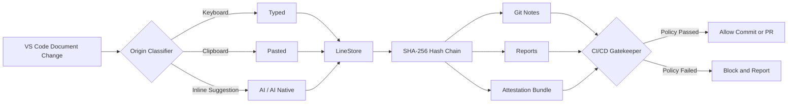

I inspected the repository and tailored this README to its actual **VS Code extension commands, React/Vite playground, SHA-256 hash chain, Git Notes, reports, attestations, heatmaps, CodeLens, and CI gatekeeper**. 

Replace your existing `README.md` with this:

````markdown
<div align="center">


# 🧬 Code Provenance Tracker

### Cryptographic authorship tracking for the AI-assisted development era


<br/>

<a href="https://github.com/vedantyerne1-art/code-provience/stargazers">
  
</a>
<a href="https://github.com/vedantyerne1-art/code-provience/network/members">
  
</a>
<a href="https://github.com/vedantyerne1-art/code-provience/issues">
  
</a>


<br/><br/>

 •
 •
 •
 •
 •
 •


</div>

---

## Overview

**Code Provenance Tracker** is a privacy-conscious VS Code extension and interactive web playground that records how code enters a project.

It distinguishes between:

- ⌨️ **Hand-typed code**
- 📋 **Pasted code**
- ✨ **AI-generated code**
- 🤖 **Committed inline AI suggestions**

Every tracked event can be added to a tamper-evident SHA-256 hash chain and anchored to a Git commit through:

```text
refs/notes/provenance
```

The resulting provenance data can power reports, attestation bundles, pre-commit verification, repository seals, and configurable CI/CD policies.

> **Every line has an origin. Every event has a hash. Every commit can carry proof.**

---

## Live Provenance Pipeline

<div align="center">


</div>

---

## Features

| Feature | Description |
|---|---|
| ⌨️ **Typed-code tracking** | Detects code created through normal keyboard input. |
| 📋 **Paste detection** | Identifies code inserted through clipboard operations. |
| ✨ **AI suggestion interception** | Marks committed native inline suggestions from compatible coding assistants. |
| 🌡️ **Editor heatmap** | Displays visual provenance indicators directly inside the editor. |
| 🧠 **Function-level labels** | Uses CodeLens to show typed, pasted, and AI distribution above functions. |
| 🔗 **SHA-256 hash chain** | Connects provenance events through tamper-evident cryptographic links. |
| 📝 **Git Notes anchoring** | Attaches provenance metadata to commits without modifying source files. |
| 📊 **Provenance reports** | Generates graphical, Markdown, and detailed authorship reports. |
| 📦 **Attestation bundles** | Exports portable provenance records with an attestation digest. |
| 🪝 **Pre-commit enforcement** | Installs a Git hook that verifies provenance before committing. |
| 🛡️ **CI/CD gatekeeper** | Generates GitHub Actions verification with configurable AI thresholds. |
| 🚀 **GitHub synchronization** | Pushes commits and `refs/notes/provenance` records to the remote repository. |
| 🔒 **Repository seal** | Generates an authenticity section containing authorship percentages and the terminal root hash. |
| 🧪 **Tamper simulation** | Demonstrates how altered hash-chain events are detected and blocked. |

---

## Architecture



### How it works

1. The VS Code extension listens for document changes.
2. Each change is classified as typed, pasted, AI, or AI-native.
3. Line-level provenance metadata is maintained inside the `LineStore`.
4. Events are linked through a canonical SHA-256 hash chain.
5. Provenance snapshots are attached to commits using Git Notes.
6. Reports and attestation bundles summarize the authorship data.
7. Pre-commit hooks and GitHub Actions enforce configurable policies.

---

## Interactive Playground

The repository also includes a React-based playground for testing the provenance workflow in a browser.

It provides:

- A multi-file live code editor
- Typed, pasted, and AI event simulation
- Language detection and validation
- Real-time authorship percentages
- Cryptographic event visualization
- Policy configuration controls
- Tamper simulation
- Visual and Markdown reports
- Attestation bundle export
- Local workspace persistence

---

## Quick Start

### Prerequisites

Make sure the following tools are installed:

- Git
- Node.js and npm
- Visual Studio Code `1.85+`

### 1. Clone the repository

```bash
git clone https://github.com/vedantyerne1-art/code-provience.git
cd code-provience
```

### 2. Install dependencies

```bash
npm install
```

### 3. Run the web playground

```bash
npm run dev
```

Open the Vite development server:

```text
http://localhost:3000
```

### 4. Load the VS Code extension

From the project directory, run:

```bash
code --new-window --extensionDevelopmentPath=.
```

Then open the Command Palette:

```text
Windows/Linux: Ctrl + Shift + P
macOS:         Command + Shift + P
```

Search for:

```text
Provenance:
```

---

## Extension Commands

| Command | Purpose |
|---|---|
| `Provenance: Hello World` | Confirms that the extension is active. |
| `Provenance: Toggle Heatmap` | Shows or hides provenance decorations. |
| `Provenance: Save Git Note` | Saves the current provenance snapshot to `HEAD`. |
| `Provenance: Show Git Note` | Displays the provenance note attached to `HEAD`. |
| `Provenance: Verify Hash Chain` | Checks every cryptographic event link for tampering. |
| `Provenance: Generate Provenance Report` | Opens a visual or Markdown provenance report. |
| `Provenance: Export Detailed Report` | Exports the detailed authorship report. |
| `Provenance: Export Attestation Bundle` | Creates a portable JSON attestation bundle. |
| `Provenance: Install Git Pre-Commit Hook` | Adds provenance verification before commits. |
| `Provenance: Run and Analyze Code` | Runs the current file with provenance-aware analysis. |
| `Provenance: Push Code and Records to Remote` | Pushes Git commits and provenance notes. |
| `Provenance: Generate CI/CD Gatekeeper` | Generates the GitHub Actions policy workflow. |
| `Provenance: Generate Final Repository Seal` | Updates this README with the authenticity seal. |

---

## Supported Languages

The default extension configuration tracks:

<p align="center">


</p>

- JavaScript
- TypeScript
- Python
- Java
- C++
- Rust
- Go
- C#
- SQL

Configure the language allowlist inside VS Code settings:

```json
{
  "provenance.supportedLanguages": [
    "javascript",
    "typescript",
    "python",
    "java",
    "cpp",
    "rust",
    "go",
    "csharp",
    "sql"
  ]
}
```

Files outside this allowlist are not actively tracked.

---

## Technology Stack

<div align="center">


</div>

| Layer | Technology |
|---|---|
| Extension | VS Code Extension API |
| Runtime | Node.js |
| Frontend | React 19 |
| Language | JavaScript and TypeScript |
| Build tool | Vite 6 |
| Styling | Tailwind CSS 4 |
| Icons | Lucide React |
| Animation | Motion |
| Cryptography | SHA-256 |
| Commit metadata | Git Notes |
| Automation | GitHub Actions |

---

## Project Structure

```text
code-provience/
├── extension.js                 # VS Code extension entry point
├── index.html                   # Browser playground entry point
├── package.json                 # Commands, scripts and dependencies
├── vite.config.ts               # Vite configuration
├── tsconfig.json                # TypeScript configuration
│
├── src/
│   ├── App.tsx                  # Interactive provenance dashboard
│   ├── main.tsx                 # React application entry
│   ├── provenanceEngine.ts      # Browser provenance engine
│   ├── tracker.js               # VS Code edit-origin tracker
│   ├── lineStore.js             # Line-level provenance storage
│   ├── hashChain.js             # SHA-256 event chain
│   ├── gitNotes.js              # Git Notes persistence
│   ├── decorations.js           # Editor heatmap decorations
│   ├── codeLens.js              # Function-level nutrition labels
│   ├── report.js                # Markdown and HTML reports
│   ├── verifier.js              # Attestation and hook verification
│   ├── runner.js                # Provenance-aware code execution
│   ├── pipelineGen.js           # GitHub Actions generator
│   ├── capstone.js              # Repository seal generator
│   └── components/
│       └── CodePlayground.tsx   # Browser editor and event simulator
│
└── test/                        # Automated tests
```

---

## 🛡️ Cryptographic Authenticity Seal

!

> This section is intentionally generated by the extension.
>
> Open the VS Code Command Palette and run:
>
> `Provenance: Generate Final Repository Seal`

The command will replace this section with:

- Human and AI authorship percentages
- Terminal SHA-256 root hash
- Number of cryptographic events
- Git Notes reference
- Seal generation timestamp

---

## Git Notes Synchronization

Provenance data is stored under:

```text
refs/notes/provenance
```

### View the note attached to `HEAD`

```bash
git notes --ref=refs/notes/provenance show HEAD
```

### Fetch provenance notes

```bash
git fetch origin refs/notes/provenance:refs/notes/provenance
```

### Push provenance notes

```bash
git push origin refs/notes/provenance
```

You can also use:

```text
Provenance: Push Code and Records to Remote
```

---

## CI/CD Gatekeeper

Generate the workflow using:

```text
Provenance: Generate CI/CD Gatekeeper
```

The generated GitHub Actions pipeline can:

- Fetch provenance Git Notes
- Verify the SHA-256 hash chain
- Detect modified or broken event links
- Calculate human, pasted, and AI contribution
- Enforce a configurable maximum AI percentage
- Block commits or pull requests that violate policy

Example policy concept:

```text
Maximum AI contribution: 40%
Hash chain required:      Yes
Action on violation:      Fail workflow
```

---

## Available Scripts

| Command | Description |
|---|---|
| `npm run dev` | Starts the playground at port `3000`. |
| `npm run build` | Creates the production web build. |
| `npm run preview` | Previews the production build. |
| `npm test` | Runs the automated test suite. |
| `npm run lint` | Runs TypeScript validation without emitting files. |

### Validate the project

```bash
npm test
npm run lint
npm run build
```

---

## Security and Privacy

Code Provenance Tracker is designed to create useful authorship evidence without placing clipboard contents inside exported provenance records.

Provenance records can include:

- Origin classifications
- Aggregate line counts
- Line metadata
- Timestamps
- Cryptographic hashes
- Policy evaluation results

The browser playground stores its working files and provenance state locally using browser storage. Use **Reset Workspace** to clear the playground state.

> Provenance metadata is an audit signal. Teams should combine it with code review, access controls, signed commits, and established security practices.

---

## Contributing

Contributions, bug reports, and feature proposals are welcome.

### Contribution workflow

```bash
# Fork and clone the repository
git clone https://github.com/YOUR_USERNAME/code-provience.git
cd code-provience

# Create a feature branch
git checkout -b feature/your-feature

# Install dependencies
npm install

# Test your changes
npm test
npm run lint
npm run build

# Commit and push
git add .
git commit -m "feat: add your feature"
git push origin feature/your-feature
```

Then open a pull request against the `main` branch.

---

## Support

If you find a bug or want to request a feature:

- Open a GitHub issue
- Include reproduction steps
- Include your VS Code version
- Include the affected programming language
- Never publish private source code or sensitive provenance records

---

<div align="center">

### ⭐ Star the repository if you believe software authorship should be verifiable

**Built by **


</div>
````

The placeholder seal section is intentional: your `Provenance: Generate Final Repository Seal` command searches for that exact heading and automatically replaces the section with the generated authorship ratio, root hash, event count, Git Notes reference, and timestamp. 
